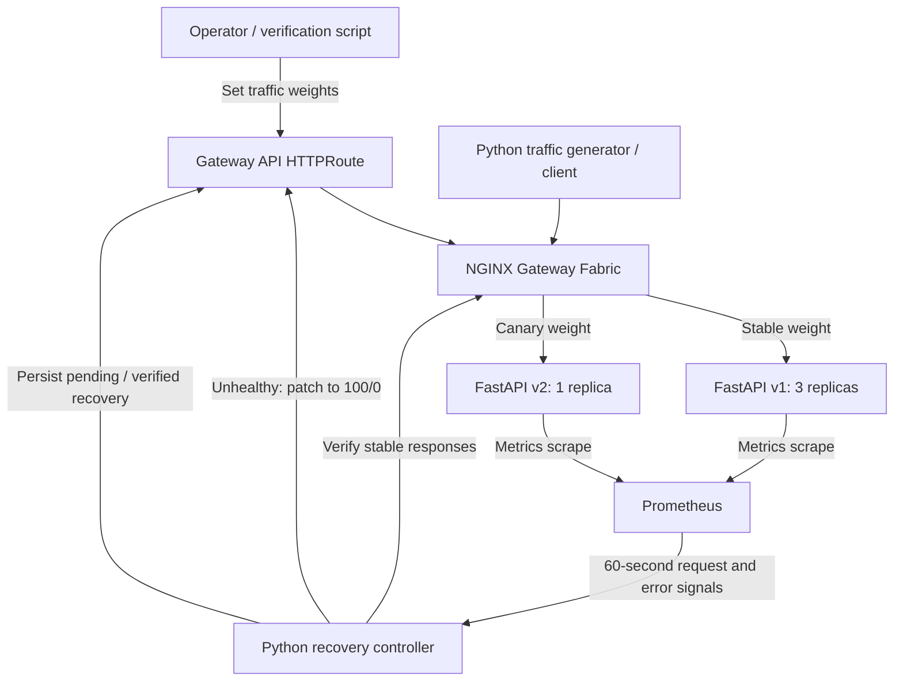
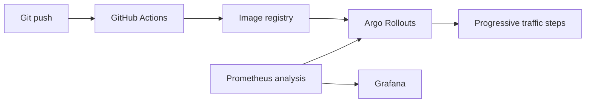

# Automated Canary Delivery & Self-Healing Rollback Engine

## Implemented local MVP

The local `k3d-canary-mvp` cluster runs three stable application replicas, one canary replica, NGINX Gateway Fabric, Prometheus, and a single Python recovery controller. Images and workloads are provisioned using the repository's setup guides. There is no Git-push-triggered deployment pipeline in the MVP.

The controller observes each active route generation for a full 60 seconds. With sufficient traffic, a canary error percentage greater than 5 triggers rollback. Healthy canaries retain their configured split. Missing or unavailable monitoring data is reported as unknown/error and does not fabricate a healthy decision or change routing.

Traffic increases are operator actions. The Phase 7 healthy-release scenario first verifies 90/10 traffic and healthy metrics, then increases to 80/20 and requires a new observation window and healthy decision. Automatic progression to 100% v2 is future work.

Rollback removes the canary from new Gateway traffic while retaining its Deployment for investigation. The controller records recovery state on the HTTPRoute, verifies stable traffic, and can resume pending verification after restart. See the [recovery guide](docs/AUTOMATED_RECOVERY.md) for policy and concurrency details.

## Verification and evidence

[Phase 7](docs/END_TO_END_VERIFICATION.md) combines the earlier phases into repeated healthy-release and failure/recovery exercises. It also checks insufficient traffic, a controller-scoped Prometheus outage, restart observation, manual traffic changes, pending recovery after restart, and interruption cleanup. The runner captures reports before restoration and requires every scenario plus cleanup to pass.

This validates the existing local installation. Fresh-cluster bootstrap, multiple recovery controllers, node/host loss, and force-kill cleanup are not exercised by this acceptance suite.

## Future architecture

Version 2 plans Argo Rollouts, automated progressive traffic steps, GitHub Actions delivery, load-testing tools, and Grafana. Version 3 plans broader health analysis, chaos experiments, multiple services, notifications, and a dashboard. These are roadmap components, not dependencies of the current MVP.

