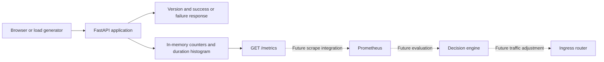

# Application: complete implementation and operating guide

Related: [Phase 1 issue history and safeguards](troubleshooting/PHASE_1_APPLICATION.md).

This document explains the application currently implemented in this repository:
what it does, why it exists, how its code works, how to run it, and what remains
for the rest of the MVP. It describes Phase 1, not a completed rollback platform.

For shorter startup instructions, see [APPLICATION.md](APPLICATION.md).
The original MVP requirements are in
[PROJECT_COTEXT.md](../AI_FEED/PROJECT_COTEXT.md).

## Contents

1. [What we have built](#1-what-we-have-built)
2. [How this fits the complete MVP](#2-how-this-fits-the-complete-mvp)
3. [Files and dependencies](#3-files-and-dependencies)
4. [Configuration and version identity](#4-configuration-and-version-identity)
5. [Startup and shutdown](#5-startup-and-shutdown)
6. [Endpoint reference](#6-endpoint-reference)
7. [Request flow and failure simulation](#7-request-flow-and-failure-simulation)
8. [Metrics and future health evaluation](#8-metrics-and-future-health-evaluation)
9. [Browser demonstration](#9-browser-demonstration)
10. [Logging and errors](#10-logging-and-errors)
11. [Installation and local operation](#11-installation-and-local-operation)
12. [Hands-on verification scenarios](#12-hands-on-verification-scenarios)
13. [Automated tests and validation](#13-automated-tests-and-validation)
14. [Troubleshooting](#14-troubleshooting)
15. [Limits and future integration](#15-limits-and-future-integration)

## 1. What we have built

We have built a small Python FastAPI service that represents the application
being released. It gives the deployment system something real to send requests
to, observe, and eventually protect with automatic rollback.

The application can:

- Identify the release and server instance that handled a request.
- Return a normal successful response.
- Deliberately fail a configurable percentage of application requests.
- Expose process liveness and application readiness endpoints.
- Count application requests and server errors and measure their duration.
- Expose those measurements in Prometheus format.
- Serve a browser page that sends requests and displays the observed results.

There is no database, authentication flow, external API dependency, or separate
frontend build. The service is intentionally small so release behavior is easy
to observe and explain.

**Application implementation is complete for Phase 1. Automatic rollout and
rollback are not implemented in this application.**

## 2. How this fits the complete MVP

The full MVP will deploy stable and canary versions, split traffic, evaluate the
canary's error rate, and restore stable traffic after a bad release.

| Responsibility | Component | Current application phase |
| --- | --- | --- |
| Answer user requests and simulate release failures | FastAPI application | Implemented |
| Display individual request results | HTML/CSS/JavaScript demo | Implemented |
| Expose release metrics | Python Prometheus client | Implemented |
| Package independently runnable releases | Docker images | Future phase |
| Run application replicas | Kubernetes on k3d | Future phase |
| Send 90% of traffic to stable and 10% to canary | Ingress routing | Future phase |
| Scrape metrics and retain their history | Prometheus server | Future phase |
| Evaluate health and change traffic weights | Python decision engine | Future phase |
| Generate sustained test traffic | Load-testing tool | Future phase |

The metrics endpoint is implemented, but a Prometheus server is not installed
by this code. Likewise, a failed response is evidence for rollback; the
application does not itself remove traffic or change a Kubernetes deployment.



Today, two locally running versions use separate ports. Starting them does not
create a 90/10 split. That requires the ingress layer we will build later.

## 3. Files and dependencies

```text
app/
  __init__.py
  config.py
  main.py
  metrics.py
  templates/
    demo.html
tests/
  test_app.py
  test_metrics.py
docs/
  APPLICATION.md
  APPLICATION_DETAILED_GUIDE.md
.env.example
.gitignore
pyproject.toml
```

| File | Responsibility |
| --- | --- |
| [app/config.py](../app/config.py) | Loads and validates startup settings |
| [app/main.py](../app/main.py) | Creates the app, registers routes, manages readiness, handles unexpected errors |
| [app/metrics.py](../app/metrics.py) | Defines metric collectors and instruments business requests |
| [app/templates/demo.html](../app/templates/demo.html) | Complete browser interface and request loop |
| [tests/test_app.py](../tests/test_app.py) | Application behavior, configuration, readiness, failures, and demo delivery tests |
| [tests/test_metrics.py](../tests/test_metrics.py) | Exact metric counts, exclusions, initial zero series, and registry isolation |
| [pyproject.toml](../pyproject.toml) | Python version requirement, packaging, dependencies, pytest and Ruff settings |
| [.env.example](../.env.example) | Example startup configuration; not loaded automatically under this filename |
| [.gitignore](../.gitignore) | Excludes local environment, caches, build artifacts, and `.env` from Git |

The Python requirement is **3.11 or newer**. The implementation was tested with
Python 3.12.3 in this workspace.

| Dependency | Why it is here |
| --- | --- |
| FastAPI | HTTP routes, lifecycle management, and exception handling |
| Uvicorn | Runs the application as an HTTP server |
| pydantic-settings | Reads environment and `.env` settings and validates them |
| prometheus-client | Creates counters/histograms and serializes the metrics endpoint |
| pytest | Runs automated tests |
| httpx | HTTP client support for application testing |
| Ruff | Python linting and formatting |
| setuptools | Packages the Python application and its HTML asset |

Development dependencies are installed using the `dev` extra. Dependency
versions currently have ranges in `pyproject.toml`; there is no committed lock
file, so a fresh installation can resolve different versions within those ranges.

## 4. Configuration and version identity

The same source code runs both releases. Environment settings make one process
represent a stable release and another process represent a faulty canary.

| Setting | Default | Accepted values | Purpose |
| --- | --- | --- | --- |
| `APP_VERSION` | `v1` | 1–64 ASCII letters, digits, dots, underscores, or hyphens; first character must be a letter or digit | Release identifier returned to clients and attached to metrics |
| `FAILURE_RATE` | `0` | Finite number from 0 through 100, including decimals | Percentage probability that `GET /` returns a simulated HTTP 500 |
| `INSTANCE_ID` | Machine/container hostname | String of 1–253 characters | Identifies the particular server in responses and request logs |

Example stable configuration:

```dotenv
APP_VERSION=v1
FAILURE_RATE=0
INSTANCE_ID=stable-local
```

Example faulty canary configuration:

```dotenv
APP_VERSION=v2
FAILURE_RATE=30
INSTANCE_ID=canary-local
```

`APP_VERSION` is a label; it is not automatically obtained from Git or a Docker
image tag. Future image/deployment configuration must keep these identities
consistent. Changing this setting does not change the application's source code.

`INSTANCE_ID` distinguishes replicas of the same release. It is not a custom
metric label. Prometheus will later identify individual scrape targets using its
own target labels; that target identity is separate from this application setting.

Settings normally come from environment variables, then `.env` in the current
working directory, then defaults. Environment values override `.env`. Tests can
also pass a `Settings` object directly to the application factory.

The configuration object is frozen after creation. Editing `.env` or changing
a terminal environment variable does not reconfigure an already running process.
Restart that process to apply changes. There is no runtime failure-setting API.

Examples rejected during application creation include `FAILURE_RATE=-1`, `101`,
`nan`, `inf`, nonnumeric text, and an empty or whitespace-containing version.
Unrelated extra fields in `.env` are ignored.

## 5. Startup and shutdown

The entry point is `create_app()` in `app/main.py`. We run Uvicorn with
`app.main:create_app --factory`, which tells it to call that function to obtain
the application. There is no module-level object named `app` to run instead.

Startup proceeds as follows:

1. Load and validate configuration, unless a settings object was supplied.
2. Select the random-number function used for failure simulation.
3. Create a private Prometheus registry and initialize its metrics.
4. Read `app/templates/demo.html` into memory.
5. Create the FastAPI app with lifecycle handling and API documentation disabled.
6. Store settings, metrics, and an initially false readiness flag on application state.
7. Register metrics middleware, the five routes, and the unexpected-error handler.
8. When the application lifespan starts, set readiness to true.

The demo asset is read during app creation. Editing it requires a process reload
or restart to affect the HTML returned by that running application.

On lifespan shutdown, readiness is set to false. This is a basic lifecycle flag;
it is not a dependency check or a complete Kubernetes traffic-draining protocol.
During actual server shutdown, the HTTP listener may already be unavailable, so
clients are not guaranteed to observe a 503 readiness response before exit.

Metrics are process-local and are lost on restart. No files or database records
are written to persist request counts.

## 6. Endpoint reference

There are **five explicit routes**, all using GET. Earlier planning referred to
six endpoints, but the actual agreed list contains five. There are no additional
deployment-management endpoints hidden behind the demo.

| Route | Normal status | Other application status | Release measurement |
| --- | --- | --- | --- |
| `/` | 200 | 500 on simulated or unexpected failure | Included |
| `/health` | 200 | No synthetic unhealthy toggle | Excluded |
| `/ready` | 200 when ready | 503 when readiness is false | Excluded |
| `/metrics` | 200 | Unexpected errors can produce 500 | Excluded |
| `/demo` | 200 | Unexpected errors can produce 500 | Excluded |

### GET /

This is the representative business request. Load tests and the browser demo
send traffic here. It takes no application parameters and has no database work.

Successful response:

```json
{
  "version": "v1",
  "instance": "stable-local",
  "message": "Request completed successfully"
}
```

Simulated failure, with HTTP status 500:

```json
{
  "version": "v2",
  "instance": "canary-local",
  "message": "Simulated application failure"
}
```

Query parameters do not control behavior. For example, `/?failure_rate=100`
does not change configuration, and `/?sample=1` still counts as a request to `/`.

### GET /health

Example response:

```json
{
  "version": "v2",
  "instance": "canary-local",
  "status": "healthy"
}
```

This is a liveness endpoint: the process can respond. It remains HTTP 200 even
when every business request is intentionally failing. If the process is dead
or unable to serve requests, a probe can fail through refusal or timeout.

It does not calculate error rates, test a database, or decide whether a release
is safe. Those are different responsibilities.

### GET /ready

While readiness is true:

```json
{
  "version": "v2",
  "instance": "canary-local",
  "status": "ready"
}
```

When readiness is false, the same identity fields are returned with
`"status": "not_ready"` and HTTP 503. Normal startup/shutdown controls this flag;
the tests also manipulate it directly. There is no public endpoint for toggling it.

The synthetic failure rate does not change readiness. This deliberately allows
the later monitoring/rollback loop to observe a bad release before removing it.

### GET /metrics

Returns Prometheus text exposition, not JSON. The content type is provided by
the Prometheus client library. It serializes the app's private registry and does
not contact a Prometheus server.

Reading this endpoint does not increment business request counts. It also does
not reset existing metrics. The registry explicitly contains our application
collectors; standard process/CPU collectors are not separately registered here.

### GET /demo

Returns the HTML page described in section 9. It uses embedded CSS and JavaScript;
there are no frontend dependencies, CDN assets, or separate Node build steps.

### Caching, missing routes, and unsupported methods

Business responses and the explicit operational/demo responses use
`Cache-Control: no-store`. The demo's fetch requests also disable caching.
This helps ensure observed version information comes from a real request.

FastAPI's `/docs`, `/redoc`, and `/openapi.json` routes are disabled. Unknown paths
return 404, and unsupported methods on defined routes normally return 405.
These framework-generated responses are outside the business metrics contract;
the application's no-store policy is not installed as global middleware for them.

## 7. Request flow and failure simulation

```mermaid
sequenceDiagram
    participant Client
    participant Middleware as Business metrics middleware
    participant Route as GET / handler
    participant Metrics as In-memory metrics
    Client->>Middleware: GET /
    Middleware->>Middleware: Start timer; default status to 500
    Middleware->>Route: Handle request
    Route->>Route: Compare random draw with configured failure probability
    Route-->>Middleware: JSON response with HTTP 200 or 500
    Middleware->>Middleware: Capture status and set no-store
    Middleware->>Metrics: Record count, error if applicable, and duration once
    Middleware-->>Client: Send response
```

For a 30% failure rate, the handler compares a random number in `[0, 1)` against
`0.30`. A number strictly below `0.30` produces HTTP 500; a number equal to or
above it produces HTTP 200.

| Configuration | Effect |
| --- | --- |
| `FAILURE_RATE=0` | Normal business requests succeed; the random draw is skipped |
| `FAILURE_RATE=30` | Each business request independently has a 30% failure probability |
| `FAILURE_RATE=100` | Every normal business request produces a simulated 500 |

Thirty percent is a probability, not a fixed schedule. Ten requests might
produce one failure, five failures, or another count. Larger samples are more
useful when comparing an observed error percentage with the configured rate.

The app does not crash, stop its listener, sleep, or become unready when it
simulates a failure. It returns an ordinary JSON error response. Latency and
pod-crash injection are not implemented.

### What the middleware actually measures

The middleware instruments only HTTP requests where the method is `GET` and the
path is exactly `/`. It passes all other traffic through without updating these
metrics or emitting its business request log.

It starts a timer, captures the outgoing status, and records when the final
response body message is about to be sent. A `finally` block attempts recording
as well, with a guard that prevents counting twice.

The default status of 500 ensures an unexpected exception before a response
starts is counted as a failure. The exception handler then returns a generic
500 response. This behavior is covered by a test.

The histogram measures server-side time inside this middleware, not complete
browser round-trip time. Recording happens before the final send completes;
it does not prove the client received the response. If a send/disconnect problem
occurs after a success status was captured, that captured status can remain the
recorded outcome. Transport reliability needs additional observation later.

## 8. Metrics and future health evaluation

### Request counter

`requests_total` increases for each instrumented business request, labeled by
release, route, method, and response status.

Illustrative output after traffic:

```text
requests_total{method="GET",route="/",status="200",version="v2"} 70.0
requests_total{method="GET",route="/",status="500",version="v2"} 30.0
```

The total in this example is 100, not 70. Both successful and failed requests
belong in the denominator of an error percentage.

### Error counter

`http_errors_total` increases for business responses with status at least 500.
It has `version` and `route` labels:

```text
http_errors_total{route="/",version="v2"} 30.0
```

It provides a direct error numerator. It intentionally overlaps the 5xx entries
in `requests_total`; do not add it to the total request counter.

### Duration histogram

`request_duration_seconds` records business request durations in seconds.
Prometheus exposition includes `_bucket`, `_count`, and `_sum` series. Buckets
are cumulative counts of observations at or below each bucket boundary.

For example, a `_sum` of `0.2` and `_count` of `100` mean those observations took
0.002 seconds on average. This is an illustrative example, not a benchmark.
The code uses the Prometheus client's default histogram buckets.

Latency is measured for visibility, but the agreed initial rollback rule uses
error percentage. No latency decision rule exists in this application.

### Zero series and isolated registries

The known HTTP 200 and 500 request series, error series, and histogram label set
are initialized before traffic. A healthy version can therefore expose an
explicit zero error count rather than a missing error series.

Each app factory call creates its own registry. Two application instances in
tests do not share counts or conflict when registering metric names. Separate
server processes likewise have separate counters.

### Included and excluded traffic

| Traffic | Included? | Reason |
| --- | --- | --- |
| Successful or failed `GET /` | Yes | Represents application behavior |
| `GET /?sample=123` | Yes | Same business path |
| Demo-generated fetch to `/` | Yes | Real business request |
| `GET /health` and `/ready` | No | Probe traffic must not dilute application errors |
| `GET /metrics` | No | Scraping must not change the release denominator |
| `GET /demo` | No | Loading the observation page is not the test workload |
| Unknown paths or unsupported methods | No | Not part of the chosen business request contract |
| Requests rejected before reaching this process | No | The app cannot observe them |

There are no user IDs, random query strings, or raw unknown paths in metric
labels. This keeps the number of time series predictable.

### How the future controller will use the data

The MVP requirement is to roll back when the **canary error percentage exceeds
5% over a 60-second evaluation window**. That threshold is not a setting or a
decision implemented inside the sample application.

The intended expression, after Prometheus integration, is:

```promql
100 * sum(rate(http_errors_total{version="v2",route="/"}[60s]))
  / sum(rate(requests_total{version="v2",route="/",method="GET"}[60s]))
```

During integration, add matching selectors for the application's configured
scrape job, and any necessary namespace/release scope, to both sides. These
queries are examples; there is no configured Prometheus job in Phase 1.

This sums the errors and requests across canary replicas. Do not average each
pod's percentage without considering its traffic volume: a lightly used pod
should not have the same weight as a heavily used one.

Counters are cumulative since process creation. A raw ratio can include old
traffic; a windowed rate is needed for recent release health. Prometheus must
first collect enough samples to compute that rate. On restart counters reset,
so queries should use rate/increase rather than naive subtraction.

Zero errors with real traffic is different from no traffic. A zero denominator
produces an undefined ratio; missing scrape data can produce no usable result.
Neither should be interpreted as a healthy release.

Our accepted implementation plan also proposed a full observation window,
15-second evaluation intervals, at least 100 canary requests per window, and
10% → 25% → 50% → 100% progression. These belong to the future controller and
are not currently enforced by the application.

## 9. Browser demonstration

Open `/demo` on the application server. The page calls `fetch('/')`, so requests
go to the root path of the same origin: same scheme, hostname, and port.

If the page was opened on port 8000, it calls port 8000. It does not discover
the other local process on port 8001. Once a common ingress origin routes the
requests, the page can observe whichever version answers each new request.

| Control | Behavior |
| --- | --- |
| Send one request | Sends one request and records its result |
| Start requests | Starts a sequential request loop |
| Stop | Cancels future scheduled requests; an in-flight request finishes or times out |
| Reset observations | Clears this page's counters, version totals, and rows when idle |

The loop waits 500 milliseconds after a request finishes before scheduling
another. Fast responses yield approximately two requests per second; slow
responses reduce that rate. The page avoids overlapping requests and disables
conflicting controls while running or waiting.

Each request has a five-second abort timer. Failed fetches or timeouts are shown
as connection failures. A returned HTTP 500 is handled as an HTTP response and
increases the server-error count. Invalid/non-JSON response bodies are tolerated,
with unknown version/instance information instead of breaking the interface.

Displayed observations include:

- HTTP response count and HTTP 5xx count.
- HTTP 5xx percentage across this page's observed HTTP responses.
- Connection failures, separately from the HTTP error percentage.
- Response counts and shares by reported version.
- The newest 50 request rows with local time, version, instance, status, duration.

The headline error rate includes all versions seen by this page; it is not a
canary-only Prometheus calculation. Counters continue beyond the 50 visible rows.
They are kept only in JavaScript memory, and reload/reset clears them. Resetting
the page does not reset server metrics or future Prometheus history.

The page does not poll `/metrics`, calculate a rolling 60-second gate, show an
authoritative rollout status, or issue deployment commands. Its observed traffic
shares can differ from configured routing weights in a small sample.

At approximately two requests per second and a 10% canary split, the browser
would generate only about 12 canary requests per minute on average. That is well
below the proposed 100-request canary minimum. Use the later load generator for
rollout validation; this page is for human observation.

## 10. Logging and errors

Each instrumented request emits an INFO message using the `uvicorn.error`
logger. The message body is JSON with fields such as:

```json
{
  "event": "application_request",
  "version": "v2",
  "instance": "canary-local",
  "method": "GET",
  "route": "/",
  "status": 500,
  "duration_seconds": 0.000231
}
```

The duration above is illustrative. Uvicorn may prefix this message with its
normal log formatting, so the entire output line is not necessarily raw JSON.
Uvicorn's separate access logs can also appear. If the configured log level is
above INFO, business request messages will not be displayed.

An unexpected exception is logged with its traceback and returned to the client
as HTTP 500 with:

```json
{
  "version": "v2",
  "instance": "canary-local",
  "message": "Internal application error"
}
```

Exception details are not included in that response. The generic handler applies
to unhandled exceptions, while normal framework errors such as 404/405 use their
normal framework response format. Exceptions on operational routes remain outside
the business counters because only `GET /` is instrumented.

## 11. Installation and local operation

Run commands from the repository root. The examples use Bash and a local
virtual environment, with no need to activate it.

### Install dependencies

```bash
python3 --version
python3 -m venv .venv
.venv/bin/python -m pip install -e '.[dev]'
```

The editable installation makes local source changes available to subsequent
server starts. The development extra includes tests and lint tools. It does
not install Docker, Kubernetes, or a Prometheus server.

### Terminal A: stable release

```bash
APP_VERSION=v1 FAILURE_RATE=0 INSTANCE_ID=stable-local \
  .venv/bin/uvicorn app.main:create_app --factory \
  --host 127.0.0.1 --port 8000 --workers 1
```

Open http://127.0.0.1:8000/demo.

### Terminal B: canary release

```bash
APP_VERSION=v2 FAILURE_RATE=30 INSTANCE_ID=canary-local \
  .venv/bin/uvicorn app.main:create_app --factory \
  --host 127.0.0.1 --port 8001 --workers 1
```

Open http://127.0.0.1:8001/demo. This process should produce a mix of successful
and simulated failing business responses over repeated requests.

### Optional .env configuration

Create a local `.env` file using [.env.example](../.env.example) as a reference.
It is ignored by Git. A server started without command-line environment overrides
will use those values, falling back to defaults for unspecified settings.

Explicit environment values in the commands above help prevent a shared `.env`
from accidentally giving both processes the same version or failure behavior.

### Stop and restart

Use Ctrl+C in the relevant server terminal. To change failure rate, stop the
canary and rerun its command with a different value. Use `FAILURE_RATE=100` for
deterministic failure, or `0` for a healthy canary.

These examples bind to localhost. Container startup will later use `0.0.0.0` so
traffic can enter the container. Use one worker per container; scaling is discussed
in section 15.

## 12. Hands-on verification scenarios

These exercises verify the application. They do not demonstrate automatic
rollback, because the controller and traffic router are not yet connected.

### Scenario A: identify the healthy release

With stable running on port 8000:

```bash
curl -i http://127.0.0.1:8000/
```

Expect HTTP 200, version `v1`, instance `stable-local`, the success message, and
`Cache-Control: no-store`. Repeat the request; with failure rate zero it should
continue succeeding unless there is a separate runtime problem.

### Scenario B: prove a deliberately bad release is still observable

Restart the canary on port 8001 with `FAILURE_RATE=100`, then run:

```bash
curl -i http://127.0.0.1:8001/
curl -i http://127.0.0.1:8001/health
curl -i http://127.0.0.1:8001/ready
curl -i http://127.0.0.1:8001/metrics
```

Expect HTTP 500 for `/` and HTTP 200 for the other three while the server is
ready. The version in business/probe responses should be `v2`. This is the
deliberate separation between release failure and process availability.

### Scenario C: observe mixed failures

Restart the canary with `FAILURE_RATE=30`, open its demo page, and select Start
requests. Observe successful and failed responses over time, then select Stop.
Do not expect an exact 30% result in a short sample.

### Scenario D: inspect counters

After sending business traffic:

```bash
curl -sS http://127.0.0.1:8001/metrics
```

Locate the `requests_total`, `http_errors_total`, and histogram count series.
Only business traffic should contribute. Repeated scrapes and health requests
should leave those values unchanged if no business traffic is running.

### Scenario E: distinguish browser reset from server reset

Stop the demo loop, note the server metrics, then select Reset observations.
The page returns to zero, but a metrics scrape still shows previous requests.
Restart the application process to reset its in-memory counters.

### Scenario F: reject invalid configuration

```bash
APP_VERSION=v2 FAILURE_RATE=101 \
  .venv/bin/uvicorn app.main:create_app --factory --port 8002
```

Expect a validation error during app creation and no successfully started server.
This is intentional: invalid failure settings must not silently change the demo.

## 13. Automated tests and validation

Run the suite and quality checks:

```bash
.venv/bin/pytest -q
.venv/bin/ruff check app tests
.venv/bin/ruff format --check app tests
.venv/bin/python -m pip check
```

The existing suite contains **19 test cases after parameter expansion**:

| Coverage | What it establishes |
| --- | --- |
| Zero and full failure rates | Success/failure status, identity, caching, operational endpoint availability |
| Partial failure boundary | Random draws below 0.30 fail; draws at or above 0.30 succeed |
| Readiness lifecycle | Startup ready, false state gives 503, health remains reachable, shutdown clears readiness |
| Invalid configuration | Out-of-range/nonfinite failure rates and invalid versions are rejected |
| Environment loading | Explicit version, failure rate, and instance settings are read |
| Demo delivery | HTML is served successfully without caching |
| Unexpected exception | Generic 500 retains identity, hides diagnostic text, and increments errors |
| Metric accuracy | A known two-success/two-failure sequence produces exact counts and four duration observations |
| Metric exclusions | Probes, scrapes, demo HTML, missing paths, and unsupported method do not inflate business counts |
| Initial zero series | Error and success counters are available before traffic |
| Registry isolation | Stable and canary app instances retain independent measurements |

Tests inject controlled random values, avoiding flaky statistical expectations.
They use a context-managed FastAPI test client so application lifespan runs.
Metric tests parse Prometheus exposition rather than relying on a screenshot.

During initial implementation, all 19 tests and Ruff checks passed. Additional
one-off verification started real HTTP servers and checked 50 requests per
version with concurrent clients: healthy `v1` returned 200 and fully failing
`v2` returned 500, with matching counters and working probes/demo. A headless
Chrome check exercised demo start, stop, error reporting, and reset.

Those real-server and browser checks were performed during implementation;
they are not committed browser/load-test suites. They do not establish Kubernetes
traffic distribution, sustained throughput, or automatic rollback behavior.

The initial test environment emitted two dependency deprecation warnings related
to Starlette's HTTPX test-client support and an AnyIO alias. They did not fail the
tests. Exact warnings may change when dependencies are installed again.

## 14. Troubleshooting

| Symptom | Explanation and action |
| --- | --- |
| `uvicorn` not found | Use `.venv/bin/uvicorn` and install dependencies in the project virtual environment |
| Cannot import `app` | Run from the repository root and verify the editable installation completed |
| Missing attribute `app` | Use `app.main:create_app --factory`; the module exposes a factory |
| Address already in use | Stop the server you started on that port or select another free port |
| Invalid configuration traceback | Check `APP_VERSION`, `FAILURE_RATE`, and `INSTANCE_ID` against section 4 |
| Version did not change | Restart the process; check environment overrides and which port you opened |
| Both local demos show only one version each | Expected before ingress; each page calls its own origin |
| No failures after a few requests at 30% | Short random samples vary; use 100% to verify deterministic failure |
| `/health` is 200 while `/` fails | Intentional; probes are independent of synthetic business failures |
| `/docs` is 404 | Interactive API docs are disabled; use this endpoint reference |
| Metrics do not change while scraping | Scraping is excluded; send `GET /` requests |
| Browser counters differ from metrics | Browser counts only its observations; server counts all business clients since startup |
| Demo Reset does not clear metrics | Reset affects browser memory only |
| Counts drop after restart | Expected for process-local counters; future queries must handle resets |
| Readiness is 503 | App readiness flag is false; inspect startup/lifecycle behavior |
| Demo keeps showing connection failures | Check server availability and port; the page aborts requests after five seconds |
| Business request JSON logs are absent | Check Uvicorn log level; these messages use INFO |
| Healthy scrape has zero counts | Metric series are initialized before traffic; zero counts do not prove release health |

If metric totals appear to jump between different values while scraping one
address, verify that you are not routing scrapes across different replicas or
running multiple workers behind that address. Scrape each pod independently.

## 15. Limits and future integration

### What is intentionally absent

The current application has no Dockerfile, cluster setup, rollout controller,
ingress rules, Prometheus deployment, Grafana dashboard, CI/CD pipeline, durable
deployment history, or load-test scenario. It does not call the Kubernetes API.

There is no `/deploy`, `/rollback`, `/change-traffic`, or runtime failure-control
endpoint. There is no latency injection, crash injection, database migration,
authentication, or business workflow beyond the representative request.

The simple readiness flag does not verify downstream dependencies or implement
advanced graceful draining. The global exception handler does not turn every
failure in the network path into an application metric.

### Running replicas correctly

Use one Uvicorn worker per container for this implementation. Multiple workers
have independent in-memory registries; scraping a load-balanced process address
would not yield a coherent aggregate. Python Prometheus multiprocess mode is
not configured here.

To scale, run multiple Kubernetes pods and have Prometheus scrape every pod.
Aggregate rates across targets by release. Do not scrape only an ingress address
that alternates between stable and canary applications.

The rollout configuration, container image identity, and `APP_VERSION` must agree.
Otherwise, traffic may run one artifact while metrics claim a different release.

### What later phases should preserve

1. Use `GET /` for the representative load-test workload.
2. Keep `/health`, `/ready`, and `/metrics` outside release request statistics.
3. Preserve version identity on both successful and failed responses.
4. Keep stable available while the canary is being evaluated.
5. Scrape pods independently and apply appropriately scoped queries.
6. Treat insufficient requests and missing metrics as an unresolved health decision.
7. Use measured canary behavior to change ingress traffic through the controller.

Application Phase 1 gives us the workload, deliberate failures, and measurements
needed for that sequence. The next implementation phase packages this application
into independently runnable stable and canary containers.
